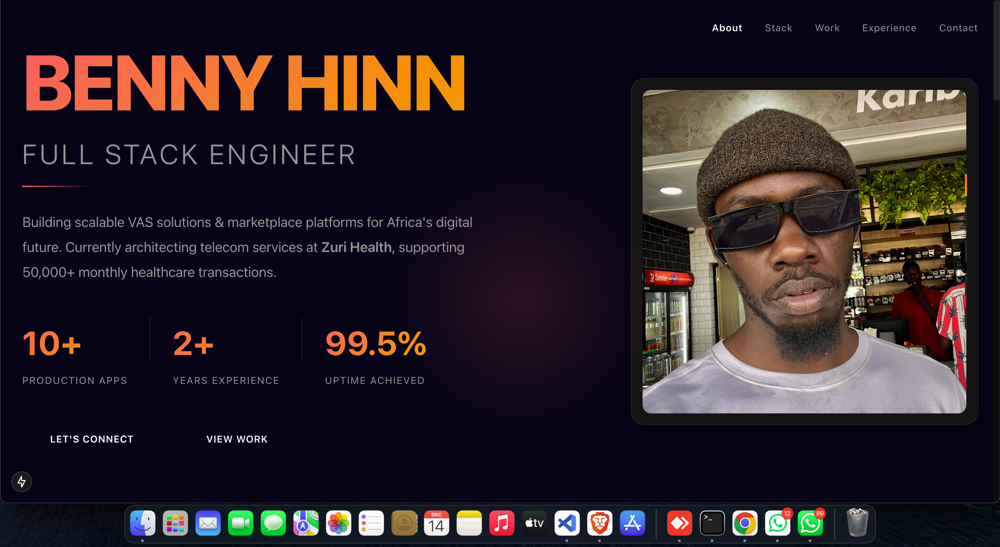

# Benny Hinn - Portfolio Website

A modern, interactive portfolio website showcasing my work as a Full Stack Software Engineer specializing in VAS solutions and marketplace platforms. Built with Next.js 15 and featuring a unique slide-based navigation system.



## 🌟 Features

- **Slide-Based Navigation** - Smooth, cinematic transitions between sections using mouse wheel, keyboard arrows, or navigation dots
- **Interactive Cursor Effects** - Custom glowing cursor that follows mouse movement
- **Responsive Design** - Fully optimized for desktop, tablet, and mobile devices
- **Performance Optimized** - Built with Next.js 15 and Turbopack for lightning-fast load times
- **Modern UI/UX** - Contemporary design with coral/amber gradient theme and glassmorphism effects
- **Accessibility First** - WCAG compliant with keyboard navigation and screen reader support
- **Animated Components** - Smooth fade-in animations and hover effects throughout

## 🛠️ Tech Stack

- **Framework:** Next.js 15.0.6
- **React:** 19.0.0
- **Styling:** TailwindCSS 3.4.1
- **Font:** Inter (Google Fonts)
- **Deployment:** Vercel (recommended)

## 📋 Prerequisites

Before you begin, ensure you have the following installed:

- Node.js 18.x or higher
- npm or yarn package manager

## 🚀 Getting Started

### Installation

1. Clone the repository:

```bash
git clone https://github.com/coderbenny/bennyhinn.life.git
cd portfolio
```

2. Install dependencies:

```bash
npm install
# or
yarn install
```

3. Add your profile image:

- Place your profile photo in the `public` folder
- Recommended size: 400x500px or similar aspect ratio
- Format: JPG, PNG, or WebP

4. Run the development server:

```bash
npm run dev
# or
yarn dev
```

5. Open [http://localhost:3000](http://localhost:3000) in your browser

### Building for Production

```bash
npm run build
npm start
```

## 📁 Project Structure

```
portfolio/
├── app/
│   ├── components/
│   │   ├── slides/
│   │   │   ├── HeroSlide.js          # Hero section with intro
│   │   │   ├── TechStackSlide.js     # Technologies & certifications
│   │   │   ├── ProjectsSlide.js      # Portfolio projects
│   │   │   ├── ExperienceSlide.js    # Work experience timeline
│   │   │   └── ContactSlide.js       # Contact information
│   │   ├── ui/
│   │   │   ├── Button.js             # Reusable button component
│   │   │   ├── StatItem.js           # Statistics display
│   │   │   ├── SectionTitle.js       # Section headers
│   │   │   ├── TechCategory.js       # Tech stack categories
│   │   │   ├── CertificationItem.js  # Certification cards
│   │   │   ├── ProjectCard.js        # Project showcase cards
│   │   │   ├── TimelineItem.js       # Experience timeline items
│   │   │   └── ContactMethod.js      # Contact links
│   │   ├── CursorGlow.js             # Animated cursor effect
│   │   ├── Navigation.js             # Top navigation bar
│   │   └── SlideIndicators.js        # Side navigation dots
│   ├── page.js                       # Main page component
│   ├── layout.js                     # Root layout with metadata
│   └── globals.css                   # Global styles and animations
├── public/
│   ├── benny-logo.jpeg               # Profile image
├── jsconfig.json
├── package.json
├── postcss.config.mjs
├── tailwind.config.js
├── next.config.mjs
└── README.md
```

## 🎨 Customization

### Personal Information

Update your information in the respective slide components:

**HeroSlide.js** - Name, title, and statistics
**TechStackSlide.js** - Technologies and certifications
**ProjectsSlide.js** - Your projects and accomplishments
**ExperienceSlide.js** - Work experience
**ContactSlide.js** - Contact information and social links

### Color Theme

The portfolio uses a coral/amber gradient theme. To customize colors, edit the CSS variables in `globals.css`:

```css
:root {
  --coral-500: #ff6b6b;
  --coral-400: #ff8787;
  --amber-500: #ffa500;
  --amber-400: #ffb733;
  --bg-primary: #0a0a0a;
  --bg-secondary: #141414;
  --text-primary: #ffffff;
  --text-secondary: #a0a0a0;
  --border-color: #2a2a2a;
}
```

### Typography

The portfolio uses the Inter font family. To change fonts, update the Google Fonts link in `app/layout.js`:

```javascript
<link
  href="https://fonts.googleapis.com/css2?family=YourFont:wght@300;400;600;700;800&display=swap"
  rel="stylesheet"
/>
```

## 🎯 Key Components

### Navigation System

- **Mouse Wheel:** Scroll up/down to navigate between slides
- **Keyboard:** Use arrow keys (↑/↓) to navigate
- **Indicators:** Click the dots on the right side
- **Top Nav:** Click section names in the navigation bar

### Responsive Breakpoints

- **Mobile:** < 768px
- **Tablet:** 768px - 1024px
- **Desktop:** > 1024px
- **Large Desktop:** > 1440px
- **Ultra-wide:** > 1920px

## 📱 Browser Support

- Chrome (latest)
- Firefox (latest)
- Safari (latest)
- Edge (latest)
- Mobile browsers (iOS Safari, Chrome Mobile)

## ♿ Accessibility

- Keyboard navigation support
- ARIA labels for interactive elements
- Focus indicators for all clickable elements
- Reduced motion support for users with motion sensitivity
- High contrast mode support
- Semantic HTML structure

## 🚀 Deployment

### Vercel (Recommended)

1. Push your code to GitHub
2. Import your repository on [Vercel](https://vercel.com)
3. Vercel will automatically detect Next.js and configure the build
4. Deploy!

### Other Platforms

The project can be deployed on any platform that supports Next.js:

- Netlify
- AWS Amplify
- Google Cloud Run
- Digital Ocean App Platform

Build command: `npm run build`  
Output directory: `.next`

## 📊 Performance

- **Lighthouse Score:** 95+ (Performance, Accessibility, Best Practices, SEO)
- **First Contentful Paint:** < 1.5s
- **Time to Interactive:** < 3.5s
- **Bundle Size:** Optimized with Next.js automatic code splitting

## 🐛 Known Issues

- Cursor glow effect is disabled on touch devices for better performance
- Some animations may be reduced on devices with `prefers-reduced-motion` enabled

## 🤝 Contributing

This is a personal portfolio project, but suggestions and feedback are welcome!

1. Fork the project
2. Create your feature branch (`git checkout -b feature/AmazingFeature`)
3. Commit your changes (`git commit -m 'Add some AmazingFeature'`)
4. Push to the branch (`git push origin feature/AmazingFeature`)
5. Open a Pull Request

## 📄 License

This project is open source and available under the [MIT License](LICENSE).

## 📧 Contact

**Benny Hinn**  
Full Stack Software Engineer | VAS Solutions Developer

- Email: bhinnexclusive@gmail.com
- Phone: +254-114-092-304
- LinkedIn: [linkedin.com/in/benny-mathew](https://www.linkedin.com/in/benny-mathew)
- GitHub: [github.com/coderbenny](https://github.com/coderbenny)
- Portfolio: [https://www.bennyhinn.life](https://www.bennyhinn.life)

**Location:** Nairobi, Kenya

---

## 🙏 Acknowledgments

- Inter font by [Rasmus Andersson](https://rsms.me/inter/)
- Icons from [Heroicons](https://heroicons.com/)
- Inspiration from modern portfolio designs and contemporary web trends

---

**Built with ❤️ by Benny Hinn**

_Last Updated: December 2025_
