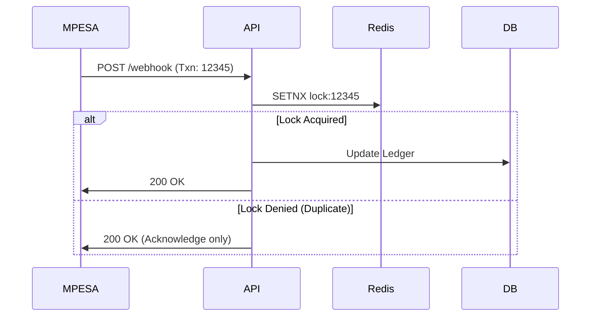

## The Chaos of Manual Ledgers

In Kenya, informal savings circles known as "Chamas" are the backbone of local micro-finance. However, the manual administration of Merry-Go-Round rotations, peer-to-peer (P2P) lending, and dividend calculations often leads to disputes, missing funds, and broken trust. 

**SmartMinds** digitizes this entire ecosystem. But when you are dealing with people's money, "move fast and break things" is a catastrophic mindset. The system must be flawless, highly available, and strictly strongly consistent.

## Transaction Integrity: Defeating Race Conditions

In a high-frequency financial application, two users might attempt to withdraw from the same Chama pool at the exact same millisecond. If the system reads the balance before the first write commits, it will allow a double-spend.

To prevent this, we abandoned default ORM behaviors and implemented explicit database row locking and pessimistic concurrency controls within MySQL using the `SERIALIZABLE` isolation level for critical ledger paths.

```python
@transaction.atomic
def process_p2p_loan(lender_id, borrower_id, amount):
    # Lock the lender's wallet row to prevent concurrent mutations
    lender_wallet = Wallet.objects.select_for_update().get(user_id=lender_id)
    
    if lender_wallet.balance < amount:
        raise InsufficientFundsError()
        
    # Proceed with multi-table write
    lender_wallet.balance -= amount
    lender_wallet.save()
    
    borrower_wallet = Wallet.objects.select_for_update().get(user_id=borrower_id)
    borrower_wallet.balance += amount
    borrower_wallet.save()
    
    LedgerEntry.objects.create(...)
```

## Idempotent M-PESA Webhooks

When interacting with external mobile money APIs like M-PESA or Paystack, the hardest challenge is handling duplicate webhooks. A delayed network response might cause the external provider to fire the `PaymentSuccess` webhook three times in a span of 5 seconds.

If not handled idempotently, a $100 deposit becomes a $300 deposit. 

We engineered a Redis-backed distributed lock utilizing the unique `TransactionID` provided by M-PESA:



By ensuring that the webhook handler checks for exact idempotency keys, we guarantee that the ledger maintains 99.9% automated accuracy across our 30+ active Chamas. Trust isn't just a UI element; it's engineered at the database layer.
