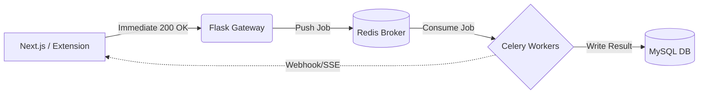

## The Problem with Digital Clutter

Knowledge workers today face a massive cognitive load, primarily driven by digital clutter. Dozens of open tabs, scattered bookmarks, and lost research trails lead to a drop in productivity. **TabMemory** was born from a simple thesis: convert digital clutter into actionable intelligence.

To achieve this, we couldn't just build a standard Chrome extension that saves URLs. We needed an accountability-first platform that actively processes, categorizes, and acts upon saved contexts. This required a resilient backend capable of handling high-throughput, asynchronous memory processing.

## The Architecture: Flask, Redis, and Celery

When designing the backend for TabMemory, the primary architectural constraint was latency. Extension APIs must respond instantly, but processing "memories"—which involves NLP categorization, screenshot generation, and metadata extraction—is inherently slow.

The solution was a decoupled asynchronous pipeline:



### Why Celery?

By offloading the heavy lifting to Celery, the Flask API remains incredibly lightweight, acting merely as a gateway. When a user saves a tab:
1. The extension POSTs the raw data.
2. Flask validates the JWT token and enqueues the payload into Redis.
3. Flask returns a `202 Accepted` immediately.

```python
@app.route('/api/v1/memories', methods=['POST'])
@jwt_required()
def create_memory():
    data = request.get_json()
    # Dispatch to Celery
    task = process_memory_task.delay(data['url'], data['context'])
    return jsonify({"task_id": task.id, "status": "processing"}), 202
```

### Achieving 99.9% Fulfillment Accuracy

In distributed systems, tasks fail. Network timeouts, rate limits from external APIs, and database deadlocks are guarantees, not possibilities.

To guarantee our 99.9% fulfillment SLA, we implemented rigorous retry policies with exponential backoff and jitter directly within the Celery task definitions:

```python
@celery.task(bind=True, max_retries=3)
def process_memory_task(self, url, context):
    try:
        metadata = extract_metadata(url)
        save_to_mysql(metadata, context)
    except OperationalError as exc:
        # Exponential backoff: 2s, 4s, 8s
        raise self.retry(exc=exc, countdown=2 ** self.request.retries)
```

## The Next Horizon: LLM Integration

The immediate next step for TabMemory is evolving from a passive manager to an active assistant. By piping the extracted text contexts through lightweight LLMs (like Llama 3 running on edge GPUs), we can auto-summarize research trails and generate actionable daily briefings for the user. 

Building the infrastructure to support this async processing was step one. The intelligence layer is next.
