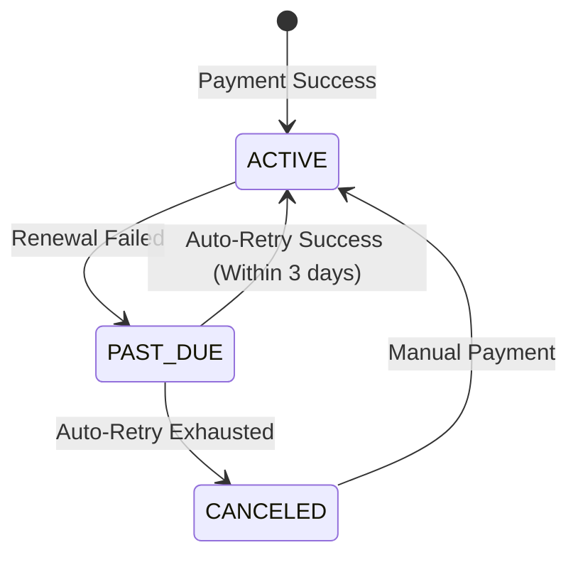

## The Hidden Complexity of Billing

Processing a one-time payment is easy. Managing a recurring subscription lifecycle across thousands of users is a distributed systems nightmare. 

For **Tizi Plus Kenya**, a fitness tracking and gym subscription platform, users expect uninterrupted access to their plans, while gyms expect guaranteed revenue reconciliation. If a payment fails, or a webhook drops, the entire state machine diverges.

## The Webhook Idempotency Guarantee

Payment gateways like Paystack and M-PESA operate on eventual consistency. They will fire a webhook when a payment succeeds, but they offer no guarantee that they will only fire it *once*.

If your webhook handler is not idempotent, a duplicate `charge.success` event might mistakenly extend a user's subscription by two months instead of one.

To prevent this, every incoming webhook must be treated as hostile until proven unique:

```python
@app.route('/api/webhooks/paystack', methods=['POST'])
def paystack_webhook():
    event = request.get_json()
    event_id = event['data']['id']
    
    # 1. Check if we've processed this exact event before
    if is_event_processed(event_id):
        return jsonify({"status": "ignored", "reason": "duplicate"}), 200

    # 2. Begin Transaction
    with db.session.begin():
        # 3. Process the business logic
        extend_user_subscription(event['data']['customer']['email'])
        
        # 4. Mark event as processed within the SAME transaction
        mark_event_processed(event_id)
        
    return jsonify({"status": "success"}), 200
```

By writing the event ID to an `processed_events` table inside the *same database transaction* as the subscription update, we guarantee that duplicate webhooks are silently discarded without corrupting user state.

## Grace Periods and Retry Mechanisms

Payment failures happen. Cards expire, mobile money accounts run dry, or APIs timeout. 

Instead of immediately locking a user out of their Tizi Plus account on the exact millisecond their subscription expires, we engineered a state machine with a `PAST_DUE` grace period. 



A Celery cron job sweeps the database nightly, identifying users in the `PAST_DUE` state and attempting a charge authorization retry using vaulted tokens. This passive recovery system saved an estimated 15% in churned MRR (Monthly Recurring Revenue) simply by handling the reality of network and card failures gracefully.
