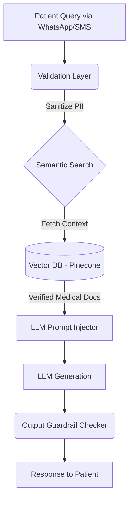

## The Hype vs. The Reality of Production LLMs

It's easy to build a medical chatbot in a Jupyter notebook over a weekend. It's incredibly difficult to deploy that same chatbot to support **50,000+ monthly telecom and healthcare transactions** without exposing sensitive Patient Health Information (PHI) or dispensing dangerous, hallucinated medical advice.

At **Zuri Health**, the objective wasn't to replace doctors, but to architect an LLM-driven triage and workflow engine that accelerates patient routing while strictly adhering to compliance protocols.

## Mitigating Hallucinations with RAG and Strict Guardrails

You cannot let an LLM "guess" in a healthcare context. To ensure factual accuracy, we bypassed generic pre-trained knowledge and implemented a strict **Retrieval-Augmented Generation (RAG)** pipeline tied directly to a curated, medically-vetted vector database.

The key to this architecture is the **Output Guardrail Checker**. Before any LLM response is returned to the user, it is parsed by a deterministic secondary system that checks for trigger words (e.g., "prescription", "diagnosis") and forces a fallback to a human agent if the confidence score is too low.

## Decoupling AI from the Core Monolith

LLM inference is incredibly slow compared to standard database queries. If you couple your AI logic directly within your primary API, a sudden spike in LLM requests will exhaust your connection pools and take down the entire system.

We engineered the AI layer as an isolated microservice communicating via asynchronous event queues (RabbitMQ). 

When a user submits a query via SMS:
1. The telecom gateway dumps the payload into a queue and returns immediately.
2. The AI microservice consumes the message, runs the heavy embedding and inference processes, and generates the response.
3. The response is pushed to an outbound queue, which the telecom gateway then dispatches back to the user.

This ensures that the core transactional systems remain highly available (99.9% SLA) regardless of OpenAI API rate limits or GPU inference latency.

Deploying AI in healthcare isn't about the smartest model; it's about the safest infrastructure.
